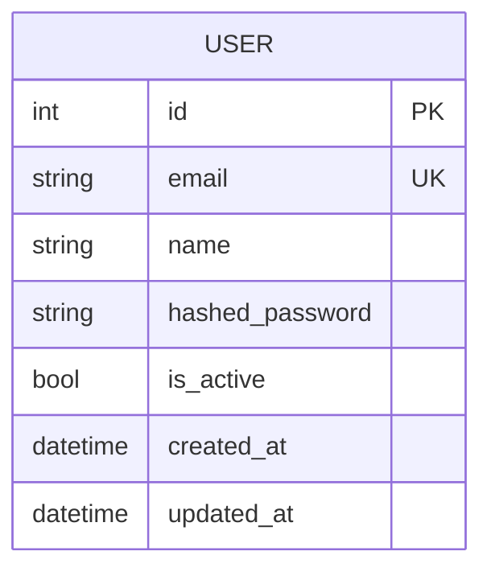

# Entity-Relationship Diagram

Update this file BEFORE writing migrations. The ERD is the spec — code implements it.

## Tables

### users

| Column | Type | Constraints | Description |
|---|---|---|---|
| id | Integer | PK, auto-increment | |
| email | String | unique, not null, indexed | Login identifier |
| name | String | not null | Display name |
| hashed_password | String | not null | bcrypt hash, never returned in API |
| is_active | Boolean | not null, default true | Soft delete flag |
| created_at | DateTime | not null, default now() | TimestampMixin |
| updated_at | DateTime | not null, default now(), on update now() | TimestampMixin |

### Indexes

| Table | Columns | Type | Purpose |
|---|---|---|---|
| users | email | unique | Login lookup |
| users | id | primary key | Default |

### Future Tables

When adding new features, define tables here BEFORE creating the Alembic migration.
Follow the pattern:
1. Add mermaid entity to the diagram above
2. Add table definition section below
3. Add indexes section
4. Then run: `alembic revision --autogenerate -m "add {table_name}"`
