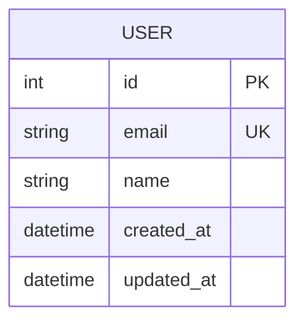

# Entity-Relationship Diagram

Update this file when adding new database tables or modifying relationships.

<!-- Use mermaid erDiagram for visual representation -->

## Tables

### User
| Column | Type | Constraints | Description |
|---|---|---|---|
| id | int | PK, auto-increment | |
| email | string | unique, not null | |
| name | string | not null | |
| created_at | datetime | not null, default now | |
| updated_at | datetime | not null, default now | |
