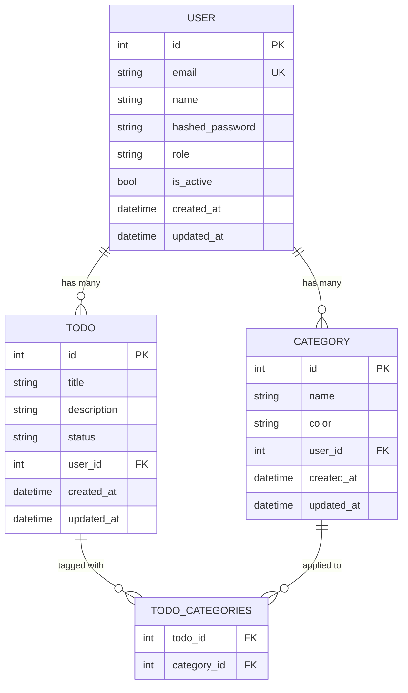

# Entity-Relationship Diagram

Update this file BEFORE writing migrations. The ERD is the spec — code implements it.

## Tables

### users

| Column | Type | Constraints | Description |
|---|---|---|---|
| id | Integer | PK, auto-increment | |
| email | String | unique, not null, indexed | Login identifier |
| name | String | not null | Display name |
| hashed_password | String | not null | bcrypt hash, never returned in API |
| role | String(20) | not null, default "user" | One of: admin, user |
| is_active | Boolean | not null, default true | Soft delete flag |
| created_at | DateTime | not null, default now() | TimestampMixin |
| updated_at | DateTime | not null, default now(), on update now() | TimestampMixin |

### Indexes

| Table | Columns | Type | Purpose |
|---|---|---|---|
| users | email | unique | Login lookup |
| users | id | primary key | Default |

### todos

| Column | Type | Constraints | Description |
|---|---|---|---|
| id | Integer | PK, auto-increment | |
| title | String | not null | Short description of the task |
| description | String | nullable | Detailed description |
| status | String | not null, default "pending" | One of: pending, in_progress, done |
| user_id | Integer | FK → users.id, not null, indexed | Owner of the todo |
| created_at | DateTime | not null, default now() | TimestampMixin |
| updated_at | DateTime | not null, default now(), on update now() | TimestampMixin |

### Indexes

| Table | Columns | Type | Purpose |
|---|---|---|---|
| users | email | unique | Login lookup |
| users | id | primary key | Default |
| todos | user_id | index | Filter todos by user |
| todos | status | index | Filter todos by status |
| todos | id | primary key | Default |

### categories

| Column | Type | Constraints | Description |
|---|---|---|---|
| id | Integer | PK, auto-increment | |
| name | String(100) | not null | Category name |
| color | String(7) | nullable | Hex color code (e.g. #ff0000) |
| user_id | Integer | FK -> users.id, not null, indexed | Owner of the category |
| created_at | DateTime | not null, default now() | TimestampMixin |
| updated_at | DateTime | not null, default now(), on update now() | TimestampMixin |

### todo_categories (junction table)

| Column | Type | Constraints | Description |
|---|---|---|---|
| todo_id | Integer | PK, FK -> todos.id (CASCADE) | |
| category_id | Integer | PK, FK -> categories.id (CASCADE) | |

### Indexes

| Table | Columns | Type | Purpose |
|---|---|---|---|
| users | email | unique | Login lookup |
| users | id | primary key | Default |
| todos | user_id | index | Filter todos by user |
| todos | status | index | Filter todos by status |
| todos | id | primary key | Default |
| categories | user_id | index | Filter categories by user |
| categories | id | primary key | Default |
| todo_categories | (todo_id, category_id) | composite PK | Unique pairing |

### Future Tables

When adding new features, define tables here BEFORE creating the Alembic migration.
Follow the pattern:
1. Add mermaid entity to the diagram above
2. Add table definition section below
3. Add indexes section
4. Then run: `alembic revision --autogenerate -m "add {table_name}"`
